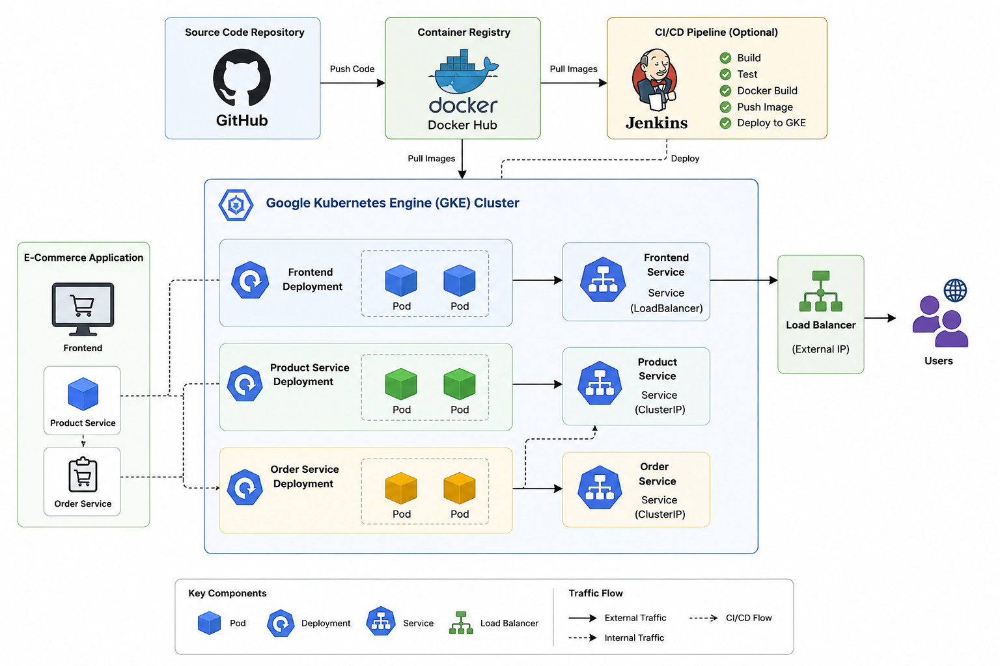
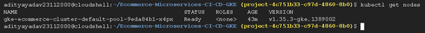
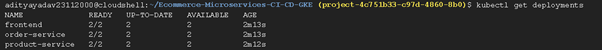
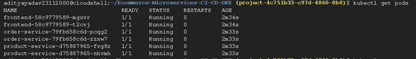
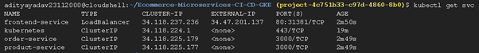
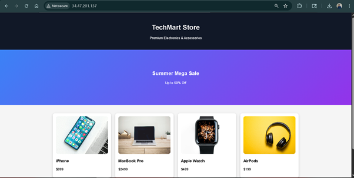

# 🚀 E-Commerce Microservices Deployment on Kubernetes (GKE)

## 📌 Project Overview

This project demonstrates the deployment of a containerized 3-tier E-Commerce application on Google Kubernetes Engine (GKE).

The application follows a microservices architecture and consists of:

* Frontend Service
* Product Service
* Order Service

Docker was used for containerization, Docker Hub for image storage, and Kubernetes for orchestration and deployment.

---

## 🛠️ Technologies Used

* Google Cloud Platform (GCP)
* Google Kubernetes Engine (GKE)
* Kubernetes
* Docker
* Docker Hub
* Git
* GitHub
* HTML/CSS
* Node.js

---

## 📂 Project Structure

Ecommerce-Microservices-CI-CD-GKE

├── frontend/

├── product-service/

├── order-service/

├── kubernetes/

│ ├── frontend-deployment.yaml

│ ├── frontend-service.yaml

│ ├── product-deployment.yaml

│ ├── product-service.yaml

│ ├── order-deployment.yaml

│ └── order-service.yaml

└── README.md

---

## 🏗️ Architecture

GitHub → Docker Hub → GKE Cluster → Kubernetes Pods → Load Balancer → Users

---

## 🚀 Kubernetes Components Used

### Deployments

* Frontend Deployment
* Product Service Deployment
* Order Service Deployment

### Services

* LoadBalancer Service
* ClusterIP Services

### Pods

* Frontend Pods
* Product Service Pods
* Order Service Pods

---

## 📋 Commands Used

### Connect to Cluster

kubectl get nodes

### Deploy Application

kubectl apply -f kubernetes/

### Verify Pods

kubectl get pods

### Verify Services

kubectl get svc

### Verify Deployments

kubectl get deployments

---

# 🚀 E-Commerce Microservices Deployment on GKE

## Architecture

## GKE Cluster

## Deployments

## Pods

## Services

## Application UI

## 🎯 Key Learnings

* Containerization using Docker
* Image Management using Docker Hub
* Kubernetes Deployments & Services
* GKE Cluster Administration
* Microservices Deployment
* Load Balancer Exposure
* Cloud Native Application Hosting.

---

## 👨‍💻 Author

Aditya Yadav

Cloud & DevOps Enthusiast